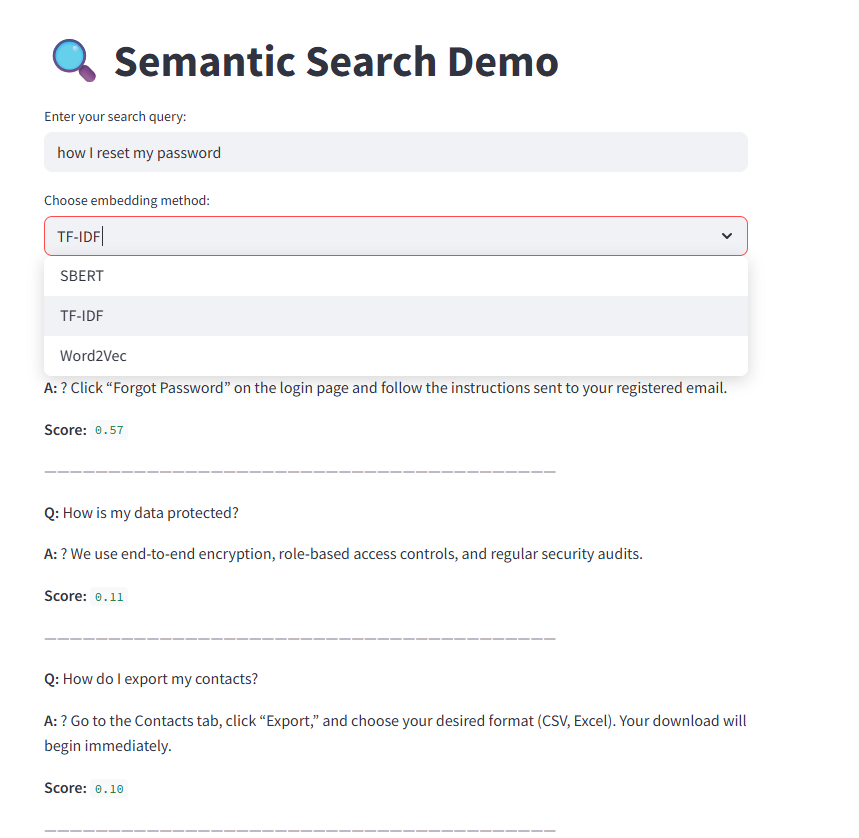

# Semantic FAQ Search App (ClientNest CRM)

This is a Streamlit-based semantic search application for querying FAQ documents using natural language. It supports multiple embedding methods: TF-IDF, Word2Vec, and SBERT.

<p align="center">
  
</p>


## Features

- Perform semantic search using:
  - SBERT (Sentence-BERT contextual embeddings)
  - Word2Vec (averaged word vectors)
  - TF-IDF (term frequency-inverse document frequency)
- Fast similarity search using FAISS
- Cosine similarity ranking
- Streamlit web interface
- Easy document customization via `docs.txt`

## Project Structure

```
semantic-search/
├── app.py                  # Streamlit UI with embedding selector
├── embeddings.py           # TF-IDF, Word2Vec, SBERT embedding functions
├── search.py               # FAISS indexing and search
├── data/
│   └── docs.txt            # Document corpus (Q&A per line)
├── requirements.txt
└── README.md
```

## docs.txt Format

Each line should contain a question followed by an answer, separated by a question mark:

```
How do I reset my password? Click "Forgot Password" on the login page and follow the instructions.
```

## How It Works

1. Select an embedding method from the dropdown
2. Documents are embedded using the selected method
3. User query is embedded using the same method
4. FAISS is used to retrieve the most similar documents
5. Results are ranked and displayed with similarity scores

## Embedding Method Comparison

| Method    | Description                               | Strengths                    |
|-----------|-------------------------------------------|------------------------------|
| TF-IDF    | Statistical frequency-based vector        | Fast, interpretable          |
| Word2Vec  | Static word embeddings averaged by doc    | Lightweight, simple          |
| SBERT     | Deep contextual sentence embeddings       | Best semantic understanding  |

## How to Run

1. Install requirements:

```
pip install -r requirements.txt
```

2. Launch the app:

```
streamlit run app.py
```

3. Open your browser at:

```
http://localhost:8501
```

## Future Improvements

- Add result feedback functionality
- Allow uploading new FAQs via UI
- Support Pinecone for persistent vector indexing
- Include ranking evaluation metrics (MRR, Precision@K)

## License

MIT License. For educational and experimental use.
